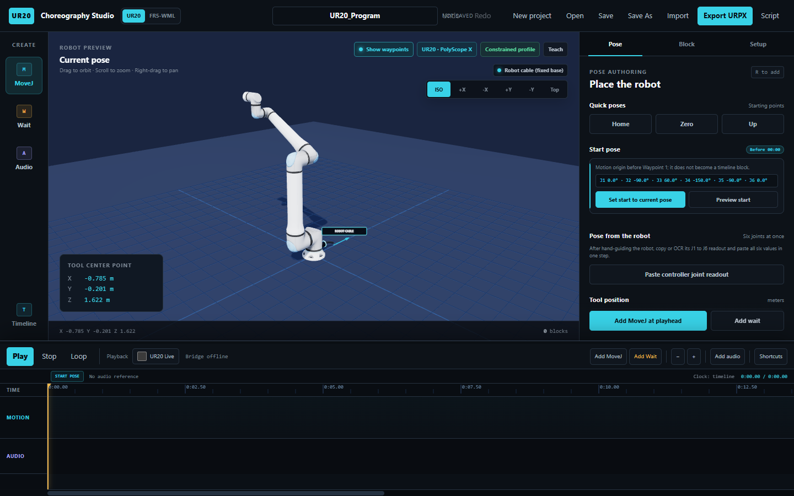

# Dual Robot Choreography Studio

Design, time, preview, and export choreography for the FAIRINO FR5-WML and
Universal Robots UR20 from a desktop browser.

**[Launch UR20](https://abbad04.github.io/dual-robot-choreography-studio/)** ·
**[Launch FR5-WML](https://abbad04.github.io/dual-robot-choreography-studio/?robot=fr5)** ·
**[Download the macOS FR5 connector](https://github.com/Abbad04/dual-robot-choreography-studio/releases/latest/download/FR5-Connector-macOS.zip)**

*UR20 visual assets: © 2023 Universal Robots A/S. Use hereof is subject to
Universal Robots A/S’ Terms and Conditions for Use of Graphical Documentation.*

> [!CAUTION]
> Physical playback is not a safety-rated teach pendant. Use a qualified
> operator, reduced-speed mode, a clear workcell, and a reachable physical
> emergency stop. Complete the manufacturer-required risk assessment before
> commanding a robot.

## What it does

The studio supports two robot profiles, selected one at a time; it does not
coordinate the FR5 and UR20 simultaneously.

| Workflow | FAIRINO FR5-WML | Universal Robots UR20 |
| --- | --- | --- |
| 3D pose authoring | Joint and Cartesian controls | Joint and Cartesian controls |
| Timeline | MoveJ, waits, seeking, looping, and optional audio | MoveJ, waits, seeking, looping, and optional audio |
| Project files | `.fr5proj` | `.ur20proj` |
| Program export | FAIRINO `RAW_*.lua` at the 8 ms ServoJ clock | URScript and URPX |
| Physical playback | Supported through the local FR5 connector | Not included |

Everything needed for authoring, previewing, project files, and export runs
client-side. No account, server, Docker installation, or robot connection is
needed for those workflows.

## Quick start

1. Open the [UR20](https://abbad04.github.io/dual-robot-choreography-studio/)
   or [FR5-WML](https://abbad04.github.io/dual-robot-choreography-studio/?robot=fr5)
   profile.
2. Place the robot with the joint or tool-position controls and add **MoveJ**
   and **Wait** blocks at the playhead.
3. Preview the timing, add an audio reference if useful, then save the project
   or export the controller program.

Use a current desktop version of Chrome, Safari, Firefox, or Edge. The editor
is designed for a desktop-sized screen.

## Connect a physical FR5

The packaged connector provides Apple Silicon and Intel builds with macOS 12
as the deployment target; release CI currently executes them on macOS 15. It
includes integrity-checked FAIRINO SDK sources for controller WebApp versions
3.9.4 through 3.9.9, so it needs no Python, Homebrew, Docker, compiler, or
first-run SDK download.

1. Download and extract the complete
   [FR5 Connector for macOS](https://github.com/Abbad04/dual-robot-choreography-studio/releases/latest/download/FR5-Connector-macOS.zip).
2. Connect the Mac to the controller by Ethernet. The robot normally uses
   `192.168.58.2`; give the Mac a different address on that subnet, such as
   `192.168.58.100/24`. Wi-Fi can remain connected.
3. Control-click **Start FR5 Connector.command**, choose **Open**, and enter
   the robot IP. Type uppercase `YES` only when physical movement is safe.
4. Leave that Terminal window open, enter its pairing code in the FR5 web app,
   and choose **Connect**.
5. Confirm **I am beside the robot and ready** only after the connector and
   controller both report that motion is enabled and safe.

Read the [complete macOS setup guide](MACOS_CONNECTOR_README.md) before the
first physical run. For Gatekeeper, read-only connection, network, SDK, or Lua
upload errors, use the [troubleshooting guide](docs/TROUBLESHOOTING.md).

Windows and Linux connector use is currently source-only and intended for
advanced users with Python 3.10+ and the controller-matched official FAIRINO
Python SDK. There is no supported standalone Windows or Linux release yet.

## How the connector is isolated

The hosted HTTPS app talks to a connector bound only to
`127.0.0.1:8766`. Each connector launch creates a new pairing code, and the
validated private controller address normally routes over the dedicated
Ethernet link. Connecting is read-only by default; motion additionally
requires the launcher’s `YES`, a ready controller safety state, and the in-app
operator confirmation.

See [Architecture and safety boundaries](docs/ARCHITECTURE.md) for the data
flow, trust boundaries, and large-trajectory transfer design.

## Repository map

| Path | Purpose |
| --- | --- |
| `index.html` | Self-contained production web app deployed by GitHub Pages |
| `fr5_connector.py` | FR5 connector entry point |
| `src/ur20_timing/` | Connector transport, safety gates, and pinned macOS SDK loader |
| `scripts/stage_macos_connector_sdk.py` | Stages verified SDK sources for release builds |
| `.github/workflows/` | Apple Silicon and Intel connector release build |
| `docs/` | Architecture and troubleshooting documentation |

Start with [CONTRIBUTING.md](CONTRIBUTING.md) before proposing a change. The
[changelog](CHANGELOG.md) records connector releases.

## Support and security

- Check [Troubleshooting](docs/TROUBLESHOOTING.md) for known setup failures.
- Search or open a [GitHub issue](https://github.com/Abbad04/dual-robot-choreography-studio/issues)
  for reproducible bugs and feature proposals.
- Report security or motion-safety vulnerabilities privately as described in
  [SECURITY.md](SECURITY.md). Do not publish an active pairing code.

## Authors

Megan Del Villar and Abbad Shazly

## License and third-party material

No project-wide open-source license is currently granted for the first-party
code in this repository. Do not assume that public source availability grants
permission to copy, modify, or redistribute it.

Embedded libraries and robot assets retain their own terms. In particular,
the FAIRINO simulator-derived visual assets are proprietary and no
redistribution permission is asserted. Read
[THIRD_PARTY_NOTICES.md](THIRD_PARTY_NOTICES.md), the bundled
[third-party license texts](THIRD_PARTY_LICENSES.md), and the
[Universal Robots asset terms](assets/ur20/LICENSE.txt) before reuse.
